# site-sense

[](https://github.com/YotamNordman/site-sense/actions/workflows/ci.yml)
[](LICENSE)

**Give your AI coding CLI eyes into web portals. No cloud. No storage. Read-only.**

<p align="center">
  
</p>

You're in a conversation with your AI assistant. It says *"go to the Azure Portal and check the NSG rules."* You alt-tab, navigate, screenshot, describe what you see, paste it back. You are the human middleware.

**site-sense eliminates this.** The AI calls an MCP tool → your browser extension captures the active tab → the AI sees what you see.

## Quick Start

```bash
git clone https://github.com/YotamNordman/site-sense.git
cd site-sense
npm install && npm run build
npm run setup -- --browser edge    # or chrome
```

Load the extension in your browser:
1. Open `edge://extensions` (or `chrome://extensions`)
2. Enable **Developer mode**
3. Click **Load unpacked** → select `dist/extension/`

Add to your CLI's MCP config:
```json
{
  "mcpServers": {
    "site-sense": {
      "command": "node",
      "args": ["/path/to/site-sense/dist/bridge/src/index.js"]
    }
  }
}
```

Then ask your AI: **"What's on my browser tab?"**

First time → popup appears → click **Allow** → done. All subsequent captures are automatic until you close the terminal.

## How It Works

```
CLI (Claude Code / Copilot CLI)
    ↕ stdin/stdout (MCP protocol)
MCP Server (TypeScript)
    ↕ Unix domain socket (no network)
Native Host (thin relay)
    ↕ Chrome native messaging (stdio)
Extension (TypeScript, Manifest V3)
    ↕ inject → content → background
Browser Tab → accessibility tree + screenshot
```

**Two MCP tools:**

| Tool | What it does |
|---|---|
| `site_sense_capture` | Accessibility tree + screenshot of active tab |
| `site_sense_status` | Check connection and session approval |

## Permission Modes

| Mode | What happens | Install warning |
|---|---|---|
| **Default** | Click extension icon per page to grant access | None |
| **All-sites** | Toggle in popup → captures work on any page | One-time prompt |

All-sites permission is revoked when the CLI session ends.

## Security

| Principle | How |
|---|---|
| No network | Native messaging (stdio) — invisible to DLP |
| No storage | Memory only — gone when CLI disconnects |
| No write ops | Never clicks, types, or modifies pages |
| No broad perms | `activeTab` + `scripting` + `nativeMessaging` |
| No secrets captured | Skips form values, strips URL tokens |
| Session-scoped | Permission resets every CLI session |

See [SECURITY.md](SECURITY.md) for threat model and DLP compliance.

## Architecture

Three-layer extension pipeline:

| Layer | Context | Role |
|---|---|---|
| **Inject** | Page (world: MAIN) | Walks DOM, builds compact accessibility tree |
| **Content** | Isolated | Relays capture via postMessage (origin-validated) |
| **Background** | Service worker | Native messaging, session state, screenshot |

## Tech Stack

| Component | Technology |
|---|---|
| Extension | TypeScript + Vite |
| MCP Server | TypeScript + `@modelcontextprotocol/sdk` + `zod` |
| Tests | vitest — 11 tests, <1s |
| Bundle | 9KB extension, 7 total deps |

## Troubleshooting

| Symptom | Fix |
|---|---|
| `connected: false` | Extension not loaded, or ID mismatch. Check `edge://extensions`. |
| `Cannot capture` | Navigate to an `http://` or `https://` page. |
| Content script not responding | Click the extension icon on the page, or enable all-sites mode. |
| Extension icon grayed out | Reload the extension at `edge://extensions`. |

## Docs

| Doc | Purpose |
|---|---|
| [SECURITY.md](SECURITY.md) | Threat model, DLP compliance |

## License

Apache-2.0
